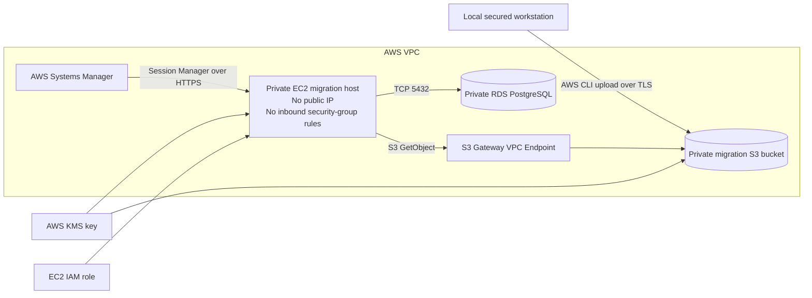

# S3, EC2, and RDS Database Migration Architecture

## Purpose

This architecture moves the existing OVHcloud PostgreSQL databases into private Amazon RDS PostgreSQL without exposing RDS to the internet and without restoring directly from GitHub.

The three application databases are handled independently:

| Source backup | Target RDS database | Application role |
|---|---|---|
| `auth_db.sql` or `auth_db.dump` | `auth_db` | `auth_db_user` |
| `church_core_db.sql` or `church_core_db.dump` | `church_core_db` | `church_core_db_user` |
| `document_core_db.sql` or `document_core_db.dump` | `document_core_db` | `document_db_user` |

Confirm the production document database name before the final backup and restore. The existing backup filename is `document_core_db.sql`, while the application role is `document_db_user`.

## Architecture



## Security model

### Migration S3 bucket

The Terraform module creates a dedicated migration bucket with:

- S3 Block Public Access enabled.
- Bucket-owner-enforced object ownership.
- AWS KMS encryption with automatic key rotation.
- Versioning enabled.
- TLS-only bucket policy.
- Lifecycle expiration for current and noncurrent backup versions.
- `force_destroy = false` by default so Terraform cannot silently delete a non-empty backup bucket.

The bucket is temporary migration storage, not the long-term RDS backup mechanism. After migration, RDS automated backups and snapshots become the authoritative database recovery system.

### EC2 migration host

The migration host is created in a private application subnet with:

- No public IP address.
- No SSH key and no inbound security-group rules.
- Access through AWS Systems Manager Session Manager only.
- Instance Metadata Service v2 required.
- Encrypted gp3 root storage.
- PostgreSQL 16 client utilities installed during bootstrap.
- A dedicated IAM role with read-only access to the migration bucket and permission to decrypt its KMS-encrypted objects.

The host is temporary. Destroy it after the restore, validation, and post-migration RDS snapshot are complete.

### RDS connectivity

The RDS instance remains private. Terraform creates a security-group relationship that allows:

```text
Migration EC2 security group -> RDS security group -> TCP 5432
```

No workstation IP address and no public CIDR is added to the RDS security group.

### S3 connectivity

A Gateway VPC Endpoint attaches to the private application route tables. The endpoint policy permits access only to the migration bucket. The EC2 instance does not need to send database backup traffic through the public internet or NAT Gateway.

Systems Manager, KMS, and package-repository traffic still require HTTPS connectivity. The current environment has NAT enabled by default. A later hardening option is to add interface VPC endpoints for `ssm`, `ssmmessages`, `ec2messages`, and `kms`.

## Terraform controls

The migration resources are disabled by default:

```hcl
enable_db_migration_storage = false
enable_db_migration_host    = false
```

On migration day, place these values in the non-committed `terraform.tfvars` file:

```hcl
enable_db_migration_storage = true
enable_db_migration_host    = true
```

The example is located at:

```text
infra/envs/prod-demo/db-migration.auto.tfvars.example
```

The bucket and migration host are controlled separately. After the migration:

1. Set `enable_db_migration_host = false` and apply to remove the EC2 instance, its instance profile, security group, RDS ingress rule, and S3 endpoint.
2. Keep `enable_db_migration_storage = true` during the agreed validation period.
3. Confirm an RDS snapshot exists and the S3 retention period has been approved.
4. Empty the migration bucket deliberately.
5. Set `enable_db_migration_storage = false` and apply to remove the bucket and KMS key.

Because `force_destroy` defaults to `false`, Terraform will refuse to remove a non-empty migration bucket.

## Migration workflow

### Phase 1: Prepare clean backups

The preferred final backup format is PostgreSQL custom format:

```bash
pg_dump \
  --format=custom \
  --no-owner \
  --no-acl \
  --dbname=auth_db \
  --file=auth_db.dump
```

Repeat for the church core and document databases. Custom-format backups can be restored with `pg_restore` and avoid source ownership and ACL statements.

The existing plain SQL files remain usable, but they contain source ownership and grant statements. They require the expected roles to exist or must be prepared carefully before restore.

### Phase 2: Create migration infrastructure

From `infra/envs/prod-demo`:

```bash
terraform init
terraform fmt -check -recursive
terraform validate
terraform plan
```

Review the plan before any apply. The plan should include:

- KMS key and alias.
- Private S3 migration bucket.
- Temporary EC2 migration host.
- EC2 IAM role and instance profile.
- S3 Gateway VPC Endpoint.
- EC2 security group with no ingress.
- RDS ingress from only the migration-host security group.

### Phase 3: Upload from the secured local PC

Retrieve the bucket name after apply:

```bash
terraform output -raw db_migration_bucket_name
```

Upload only the required database files:

```bash
export MIGRATION_BUCKET='<terraform-output-bucket-name>'
export SOURCE_DIR='/secure/local/path/db_backups'
export BACKUP_FILES='auth_db.sql church_core_db.sql document_core_db.sql'

./scripts/migration/upload-db-backups-to-s3.sh
```

The script creates SHA-256 checksums and a manifest, then uploads only the explicit backup list. It does not upload unrelated files such as `apt.extended_states.0`.

### Phase 4: Access EC2 with Session Manager

Retrieve the generated command:

```bash
terraform output -raw db_migration_ssm_start_session_command
```

Run the returned command from a workstation with the AWS CLI and Session Manager plugin.

No SSH port or key pair is required.

### Phase 5: Download and verify on EC2

Inside the Session Manager shell:

```bash
export MIGRATION_BUCKET='<migration-bucket-name>'
export MIGRATION_PREFIX='<prefix-produced-by-upload-script>'

./scripts/migration/download-db-backups-from-s3.sh
```

The script downloads the selected backup set and stops if any SHA-256 checksum fails.

### Phase 6: Prepare and restore RDS

1. Retrieve the RDS endpoint and master secret through the approved administrative process.
2. Create the three application roles and databases with `scripts/rds/bootstrap-rds-app-databases.sh`.
3. Restore each backup:
   - Plain `.sql` files use `psql -f`.
   - Custom `.dump` files use `pg_restore --no-owner --no-acl`.
4. Grant each application role access only to its respective database.
5. Create EKS Kubernetes secrets with `scripts/eks/create-church-app-secrets-from-rds.sh`.

A full PostgreSQL database dump is not restored directly by RDS from S3. S3 is the staging store; PostgreSQL client tools on EC2 perform the restore into the private RDS endpoint.

## Validation requirements

Before switching the application to RDS, compare OVHcloud and RDS for every database:

- Table list.
- Row count per table.
- Sequence values.
- Required PostgreSQL extensions.
- Representative member, user, sacrament, template, and document records.
- Uploaded document count and file sizes.
- Application role connectivity.
- `/health/db` endpoint for each backend service.

After validation:

1. Take a manual RDS snapshot.
2. Record the snapshot identifier and restore test results.
3. Remove backup files from the EC2 root volume.
4. Destroy the temporary EC2 migration host.
5. Retain or remove the S3 backup according to the approved retention period.

## Files implementing this architecture

```text
infra/modules/db-migration/
├── main.tf
├── variables.tf
└── outputs.tf

infra/envs/prod-demo/
├── db-migration.tf
├── db-migration-variables.tf
├── db-migration-outputs.tf
└── db-migration.auto.tfvars.example

scripts/migration/
├── upload-db-backups-to-s3.sh
└── download-db-backups-from-s3.sh
```
